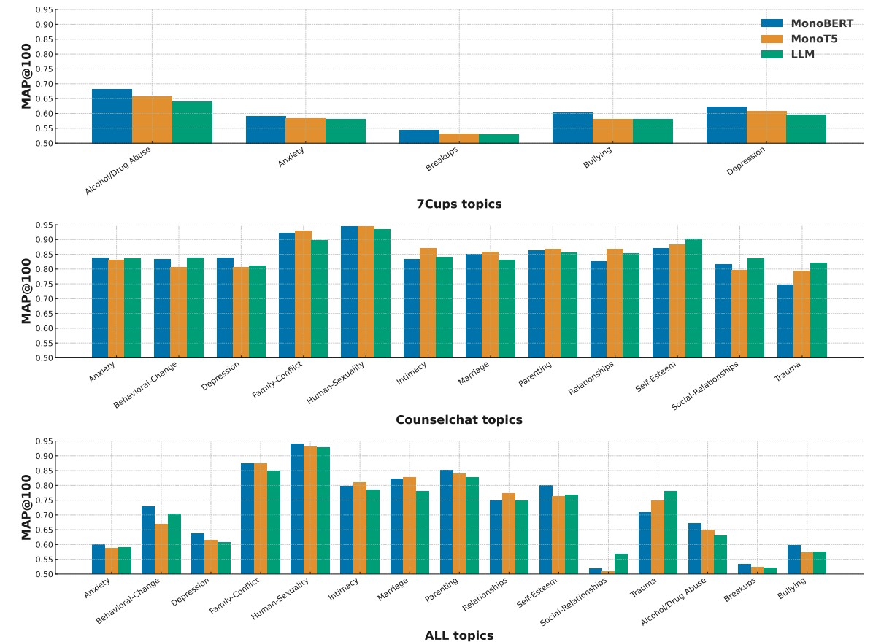

# 👩🏽‍⚕️🩺💬 _CounselingQA_: Scaling Professional Mental-Health Guidance via Dense Retrieval and Large Language Models

<!-- Author list (center-aligned) -->
<div style="text-align:center; line-height:1.4; font-family:system-ui, sans-serif;">

  <!-- Authors with numbered affiliations -->
  <a href="mailto:anxo.pvila@udc.es"> <strong>Anxo Perez</strong><sup>1</sup>,<strong>Cesar Piñeiro</strong></a><sup>1</sup>, <strong>Javier Parapar</strong><sup>1</sup>


  <!-- Affiliation list -->
  <sup>1</sup> IRLab, CITIC, Universidade da Coruña, A Coruña, Spain<br>

</div>


## 📌  Overview

This repository accompanies the paper **“_CounselingQA_: Scaling Professional Mental-Health Guidance via DenseRetrieval and Large Language Models”** and contains all code, data, and instructions needed to replicate its experiments.




## 📂 Datasets

The **CounselingQA datasets** can be requested for research purposes.   Please visit the following page for details and access instructions:

👉 [Dataset Access — Scaling Mental Support](https://erisk.irlab.org/ScalingMentalSupport.html)


## 📂 Directory Structure

```text
│
├── README.md                        # Main documentation for the project
├── elasticsearch/                   # Elasticsearch setup for data indexing and retrieval
│   └── docker-compose.yml           # Docker configuration forElasticsearch service
├── example_training_dataset/        # Example datasets for training and evaluation
│   └── 7cups/
│       ├── 7cups_triplets-train.jsonl   # Training data in triplet format from 7cups
│       └── 7cups_triplets-valid.jsonl   # Validation data in triplet format from 7cups
├── plots/                           # Visualizations and analysis plots
│   └── Counseling_Reranking_Strategies.png   # Example plot for reranking strategies
└── src/                             # Source code for models, evaluation, and utilities
    ├── dump_initial_retrieval.py    # Script to dump initial retrieval results
    ├── evaluation/                  # Evaluation scripts and metrics
    │   ├── evaluate_map_k.py                # MAP@K evaluation
    │   └── evaluate_precision_1.py          # Precision@1 evaluation
    ├── llms/                        # Scripts for LLM fine-tuning and filtering
    │   ├── filter_with_unsloth.py           # Filter data using Unsloth LLM
    │   └── finetune_llm_unsloth.py          # Fine-tune LLM with Unsloth
    └── transformers-models/         # Transformer model scripts and utilities
        ├── __init__.py                      # Init file for module
        ├── run_transformers_searches.py     # Run retrieval/searches with transformer models
        ├── monobert/                        # MonoBERT model scripts
        │   ├── __init__.py                  # Init file for MonoBERT module
        │   ├── bert_finetune.py             # Fine-tune BERT model
        │   ├── filter_with_bert.py          # Filter data using BERT
        │   └── rerank_with_bert.py          # Rerank results using BERT
        └── monot5/                          # MonoT5 model scripts
            ├── __init__.py                  # Init file for MonoT5 module
            ├── filter_with_monot5.py        # Filter data using MonoT5
            ├── finetune_t5.py               # Fine-tune T5 model
            └── rerank_with_monot5.py        # Rerank results using MonoT5
```


## 🤖 Finetuning models
This repository provides scripts to finetune three types of models for binary relevance classification (i.e., determining if a response is relevant to a mental health question):

1. MonoBERT-based Model (bert_finetune.py)
Fine-tunes a BERT-like encoder for binary classification of (question, response) pairs. Outputs a HuggingFace checkpoint for downstream use.

    ```text
    python bert_finetune.py \
      --train-file /data/all_triplets-train.jsonl \
      --valid-file /data/all_triplets-valid.jsonl \
      --model-name castorini/monobert-large-msmarco \
      --output-dir ./models/bert/bert-relevance-all \
      --max-len 384 \
      --batch-size 32 \
      --epochs 3 \
      --lr 3e-5 \
      --eval-steps 1000 \
      --save-steps 1000 \
      --early-stopping 4 \
      --fp16
    ```

2. MonoT5-based Model (finetune_t5.py)
Finetunes a (Mono)T5-style sequence-to-sequence model for binary relevance. The model is trained to generate "true" or "false" as output.

    ```text
    python finetune_t5.py \
    --train-file ./data/train.jsonl \
    --valid-file ./data/valid.jsonl \
    --model-name castorini/monot5-base-msmarco-10k \
    --output-dir ./experiments/t5/monot5-relevance-all \
    --batch-size 16 \
    --grad-accum 2 \
    --epochs 3 \
    --lr 3e-5 \
    --fp16
    ```

3. LLM with UnsLoTH + LoRA (finetune_llm_unsloth.py)
Finetunes a chat LLM (e.g., Llama-3.x) using UnsLoTH and LoRA adapters for binary relevance. The model is prompted to respond with "true" or "false" for each (question, response) pair.

    ```text
    python finetune_llm_unsloth.py \
      --train-file ./data/relevance_train.jsonl \
      --valid-file ./data/relevance_valid.jsonl \
      --base-model unsloth/Llama-3.1-8B-Instruct-bnb-4bit \
      --output-dir ./experiments/llm/llama3-8b-relevance-all \
      --epochs 2 \
      --batch-size 4 \
      --grad-accum 8 \
      --lr 2e-4 \
      --max-seq-len 2048 \
      --packing \
      --fp16
    ```

## 🔧 Experiments
*Important, this repository includes helper scripts for preparing and retrieving data with Elasticsearch.
Make sure you have an Elasticsearch instance running (default: http://localhost:9200) before executing them.
You can use any other technology for perform the semantic or BM25 retrieval.*

1.  **Index Question Responses** Index all responses from the dataset into Elasticsearch.

    ```text
    python index_responses.py \--response-file /path/to/questions_with_responses.json \ --index-name responses_all_index
    ```

2.  **Insert Embeddings** Populate the index with dense vector embeddings using a SentenceTransformer model.

    ```text
    python add_embeddings.py \
      --index-name responses_all_index \
    - -model-name sentence-transformers/all-mpnet-base-v2 \
      --vector-field embedding_mpnet_base_v2 \
      --batch-size 256
    ```    

3.  **Dump Initial Retrieval** Run a first-stage retrieval (question → top-N responses) and save results to JSON. Single run:
    ```text
    python dump_initial_retrieval.py \
      --questions-file /path/to/test-cleaned-with-clusters-questions-list.json \
      --index-name responses_all_index \
      --top-n 200 \
      --result-dir ./results/initial-retrieval
    ```

4. **Option A: Rerank with LLMs** Use the *filter_with_unsloth.py* file to rerank the initial retrieval with an LLM:

    ```text
    python finetune_llm_unsloth.py \
    --train-file ./data/relevance_train.jsonl \
    --valid-file ./data/relevance_valid.jsonl \
    --base-model unsloth/Llama-3.1-8B-Instruct-bnb-4bit \
    --output-dir ./experiments/llm/llama3-8b-relevance-all \
    --epochs 2 \
    --batch-size 4 \
    --grad-accum 8 \
    --lr 2e-4 \
    --max-seq-len 2048 \
    --packing \
    --fp16
    ```

5. **Option B: Rerank with BERT pr T5 models** Use the *run_transformer_searchers.py* selecting two of the two possible models (T5 or BERT) and two reranking strategies (filter or reorder). Strategy choices are: *choices=["bert-filter", "bert-reorder", "t5-filter", "t5-reorder"]*. For instace, if we want to use bert-reorder:


    ```text
    python run_transformers_searches.py \
      --input-file ./results/initial-retrieval/initial-retrieval__counselchat__responses_cc_index__top200__20250822-1200.json \
      --model-path /models/bert-relevance-all/checkpoint-11727 \
      --strategy bert-reorder \
      --top-k 150 \
      --batch-size 32 \
      --output-dir ./results/reranked
    ```    

## 📝 Citation

*Coming soon – paper under submission.*  
If you use this resource, please ⭐ star the repo and stay tuned for citation info.

---

## 📬 Contact

For questions, please reach out via email: `anxo.pvila@udc.es`
