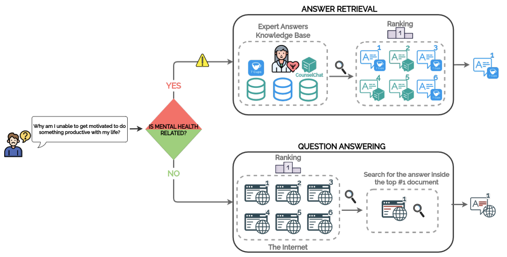

# 👩🏽‍⚕️🩺💬 _CounselingQA_: Scaling Professional Mental-Health Guidance via DenseRetrieval and Large Language Models

<!-- Author list (center-aligned) -->

  <!-- Authors with numbered affiliations -->
  <a href="mailto:anxo.pvila@udc.es"> <strong>Anxo Perez</strong>1,<strong>Cesar Piñeiro</strong></a>1, <strong>Javier Parapar</strong>1

  <!-- Affiliation list -->
  1 IRLab, CITIC, Universidade da Coruña, A Coruña, Spain 

## 📌  Overview

This repository accompanies the paper **“_CounselingQA_: Scaling Professional Mental-Health Guidance via DenseRetrieval and Large Language Models”** and contains all code, data, and instructions needed to replicate its experiments.

## 📂 Datasets

The **CounselingQA datasets** can be requested for research purposes.   Please visit the following page for details and access instructions:

👉 [Dataset Access — Scaling Mental Support](https://erisk.irlab.org/ScalingMentalSupport.html)

## Abstract
In the digital era, the internet and social media have emerged as essential platforms for individuals facing mental health issues, often used for seeking information and community support. Despite the resources of informal advice available on social media, the complexity of these issues frequently exceeds non-expert knowledge. Specialized sites such as CounselChat and 7Cups offer professional guidance, yet many at-risk individuals still rely on unmoderated sources and general web search. We address this gap by investigating ranking strategies that match pre-existing expert advice to incoming mental-health questions. We introduce CounselingQA, a collection built from two specialized websites, pairing user questions with verified expert responses. We address the task as answer retrieval (AR): given a question, rank expert answers by relevance. We evaluate dense retrieval with SentenceBERT and MentalBERT, and propose a second stage that improves the initial ranking via transformer-based models and large language models (LLMs), used for filtering non-relevant candidates and for reordering. Beyond retrieval, we analyze linguistic style and affective attributes across topics, questions, and responses, highlighting similarities and divergences between the two sources. Results show that dense retrieval provides strong candidates and that transformer/LLM-driven reranking further elevates relevant, on-topic advice to the top positions. We also include error analysis studying the benefits and limitations of our approaches. Taken together, these findings indicate that retrieval-first pipelines can help scale access to professional guidance. The CounselingQA datasets are available under a research usage agreement, and we release code and experimental materials to facilitate reproducibility.

 ## Experiments
 *Coming soon!*  

## 📝 Citation

*Coming soon – paper under submission.*  
If you use this resource, please ⭐ star the repo and stay tuned for citation info.

---

## 📬 Contact

For questions, please reach out via email: `anxo.pvila@udc.es`